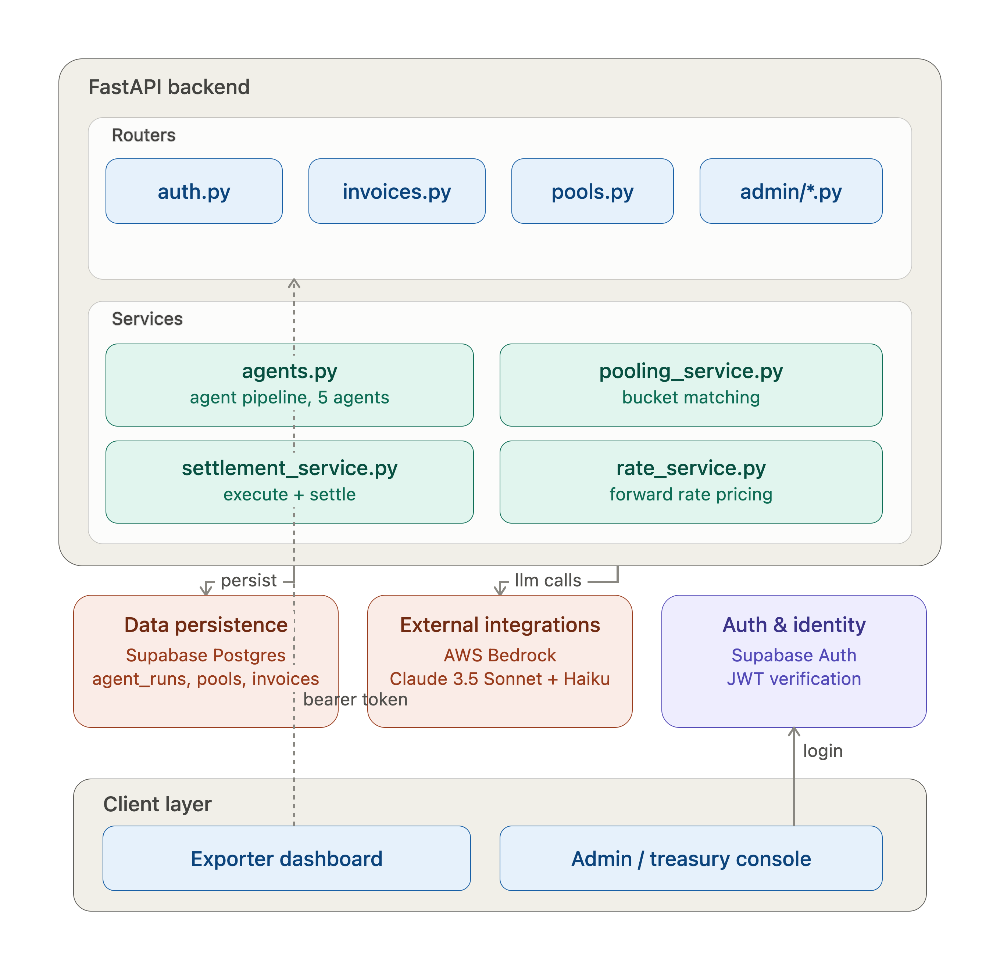

# FxPool

**Instant, fair forex hedging for small exporters — via pooled forward contracts, priced and routed by a multi-agent pipeline.**

Built for the **GIFT IFIH Young Builders' Program Hackathon** — Track 1: *Agentic AI in Financial Services*, focus area: *Autonomous Corporate Treasury & FX Hedging*.

## The problem

A small Indian exporter invoicing $20,000 to a US buyer can't get a bank to quote them a forward contract on terms anywhere near what a large corporate gets — banks quietly price in a liquidity/servicing premium for small tickets, if they'll even take the trade. The exporter either eats the FX risk unhedged, or overpays for a hedge that's small relative to a bank's minimum ticket size.

**FxPool's bet:** pool many small exporters' same-currency, same-tenor-bucket invoices into one bank-facing ticket large enough to get institutional pricing, then split the settlement back out pro-rata. The hard part isn't the pooling math — it's doing the matching, compliance, and bank-routing decisions fast enough, and legibly enough, that this can run with a human treasury officer supervising many pools instead of hand-processing each one.

## What's built

An exporter submits an invoice → a **five-agent pipeline** validates it, checks compliance exposure, routes it to a bank with capacity, assigns it to a pool, and scores the resulting pool's risk — before a human admin ever has to look at it. The admin's job becomes reviewing flagged exceptions and clicking **Execute** on pools that are ready, not manually pricing every invoice.

- **Backend:** FastAPI + Supabase (Postgres + Auth + RLS) — [`backend/README.md`](backend/README.md)
- **Frontend:** React + TypeScript + Tailwind, three surfaces (public marketing site, exporter dashboard, admin/treasury console) — [`frontend/README.md`](frontend/README.md)
- **Agents:** `backend/app/services/agents.py`, orchestrated by `run_agent_pipeline()` — full breakdown in [`docs/ARCHITECTURE.md`](docs/ARCHITECTURE.md)

## Architecture at a glance



The diagram above shows the system layout — backend routers/services, data persistence, the LLM integration, auth, and the two client surfaces. It's a snapshot of *structure*, not of the agent decision flow; for the actual invoice→pool pipeline, guardrails, and fallback behavior, see the sequence below and the full breakdown in [`docs/ARCHITECTURE.md`](docs/ARCHITECTURE.md):

```
Exporter submits invoice
        │
        ▼
┌───────────────────┐   parallel   ┌──────────────────────┐
│  Invoice Agent     │◄────────────►│  Compliance Agent     │
│  (plausibility)    │              │  (exposure limits)    │
└─────────┬──────────┘              └──────────┬────────────┘
          │                                    │
          ▼                                    │
┌───────────────────┐                          │
│  Bank Routing Agent│  (deterministic fallback │
│  (capacity match)  │   on invalid output)     │
└─────────┬──────────┘                          │
          ▼                                     │
┌───────────────────┐                           │
│  Pooling Agent     │◄──────────────────────────┘
│  (assign/new pool) │  (deterministic fallback: bucket-window pooling_service)
└─────────┬──────────┘
          ▼
┌───────────────────┐
│  Risk Agent        │  → logged to agent_runs, surfaced to admin
│  (pool-level score)│
└─────────┬──────────┘
          ▼
   Admin reviews pool  ──────►  clicks Execute (HITL gate)
          │
          ▼
┌───────────────────┐
│  Execution Agent   │  aborts if any invoice unconfirmed or compliance-rejected
└─────────┬──────────┘
          ▼
   Pool locked → settled (settlement_service.py)
```

## What's real vs. what's mocked

Disclosed explicitly and in full in [`docs/MOCKED_VS_REAL.md`](docs/MOCKED_VS_REAL.md) — required reading before the demo. Short version: the pooling/settlement math, auth, and database are real and running; the agent reasoning calls a real LLM (Claude via Bedrock) but the FX spot rates it reasons over and the bank roster/capacity it routes against are synthetic fixtures, not a live market feed or a real banking relationship.

## Quickstart

```bash
# Backend
cd backend
cp .env.example .env   # fill in Supabase + AWS Bedrock credentials
pip install -r requirements.txt
uvicorn app.main:app --reload   # http://localhost:8000/docs

# Frontend (separate terminal)
cd frontend
cp .env.example .env   # point at the same Supabase project + backend URL
npm install
npm run dev   # http://localhost:5173
```

Both `.env` files need to point at the **same Supabase project** — see `backend/app/core/supabase.py` and `frontend/src/lib/supabase.ts`. Full setup detail, including the agent test script, is in [`backend/README.md`](backend/README.md).

## Repo structure

```
backend/    FastAPI service — API, agent pipeline, pooling/settlement logic, SQL schema
frontend/   React app — public site, exporter dashboard, admin/treasury console
supabase/   Migrations
docs/       ARCHITECTURE.md, MOCKED_VS_REAL.md
```

## Team & track

Track 1 — Agentic AI in Financial Services · Focus: Autonomous Corporate Treasury & FX Hedging